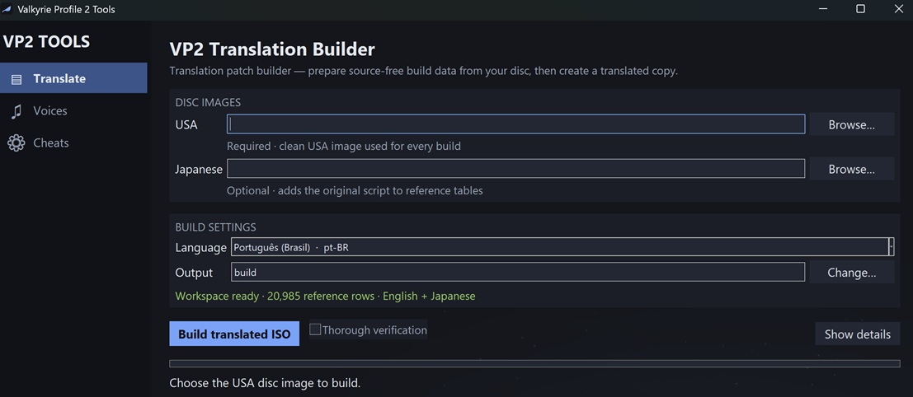

# Valkyrie Profile 2 Translations and Tools

_Valkyrie Profile 2: Silmeria_ (PlayStation 2) Tools [Showcase](https://trulio2.github.io/Valkyrie-Profile-2-Tools/)

## Requirements

- Python 3.11 or newer
- A USA disc image (`SLUS_214.52`)
- Optionally, the Japanese image (`SLPM_664.19`) for the original script

About 12 GB of free space: the source image, the patched one, and roughly
10 MB of generated tables.

## Use

Download the archive for your platform, unpack it, and open
`ValkyrieProfile2-Translator`. Choose your clean USA disc image, choose a
language, and build. The first build reads the disc into a local workspace
before it patches anything, which takes a few minutes; later builds reuse
it. A Japanese image is optional and adds the original script to the
generated reference tables.

The same operations remain available from a terminal for automation and
development:

```bash
# Open the same UI directly from a source checkout.
python vp2_translate.py
```



Or run it explicitly. One command is enough: `build` reads the disc first
when it has not been read yet.

```bash
python vp2_translate.py build <usa-image.iso>
```

The patched image is written to the current directory, or wherever
`--output` says.

`generate` does that reading on its own, for when you would rather have it
out of the way, or want the original Japanese beside the English in the
reference tables. Order does not matter, and it can be a separate run —
images are recognised by which release they are, and each run remembers
where the others were:

```bash
python vp2_translate.py generate <usa-image.iso> <japanese-image.iso>
```

`build` takes the language after the image; the default is `pt-BR`. Name any
locale under `translations/`, or give a path to a pack kept elsewhere.

```bash
python vp2_translate.py build <usa-image.iso> sv-SE
```

Each language decides for itself which of the game's resources its build
writes, so a pack that translates one menu patches one resource and finishes
in seconds.

## Commands

|                        |                                            |
| ---------------------- | ------------------------------------------ |
| `generate <image>...`  | read disc images into `workspace/`         |
| `build <image> [lang]` | build a patched image from a language pack |
| `check-pack <lang>`    | validate a language pack                   |
| `--self-check`         | verify an installation is complete         |

`generate` is optional: a build runs it when the workspace is not there
yet. Every path option defaults to a location inside the installation, so
the commands work from any directory.

## Cheats

`ValkyrieProfile2-CheatPatcher` is the second tool in this repository. It
writes chosen cheats into a copy of your disc, so they need no emulator cheat
engine to run. Open it, choose your ISO, tick the cheats, and patch; the
source image is only ever read.

```bash
python vp2_cheats.py                     # the same window
python vp2_cheats.py <usa-image.iso>     # all patches
python vp2_cheats.py <usa-image.iso> --patch angel-slayer
```

| patch                | what it does                                       |
| -------------------- | -------------------------------------------------- |
| `disable-anti-cheat` | stops the self-checksum that freezes a patched game |
| `battle-anti-freeze` | prevents the early-game late-character freeze       |
| `angel-slayer`       | Angel Slayer gets three attacks                     |
| `equip-everything`   | any character may equip any weapon or armour        |

The first is required by any patch marked `(!)`, because the game hashes its
own code after cutscenes, battles, map changes and saves, and freezes on a
mismatch. Both the window and `--patch` add it for you rather than let a
frozen ISO be built.

Nothing is written until the patcher has checked the disc it was given: the
tri-Ace resource index, the module holding each address, the exact original
instruction at it, and that every recompressed stream still fits its original
allocation. The patched copy is then read back and verified before it takes
its final name. See [docs/cheat-patches.md](docs/cheat-patches.md).

## Build release artifacts locally

The Linux archive is built by the same `Dockerfile` used by the release
workflow. From this directory, run:

```bash
docker build --target artifact --build-arg VERSION=dev-local --output type=local,dest=release .
```

This produces both Linux archives — `ValkyrieProfile2-Translator-` and
`ValkyrieProfile2-CheatPatcher-dev-local-linux-x64.tar.gz` — after running the
regression suite, language-pack checks, a frozen-binary self-check for each,
and an archive unpack/self-check round trip for each. The container fixes
Ubuntu 24.04, the setup-python 3.11.16 toolcache build, and PyInstaller 6.22.2.

A Windows executable must be built on Windows; PyInstaller does not
cross-compile it from Linux. Use official 64-bit Python 3.11.9 with Tk and the
same pinned packager:

```powershell
python -m pip install --disable-pip-version-check "pyinstaller==6.22.2"
python -m unittest discover -s tests -q
python -m PyInstaller data/vp2_release.spec --workpath workspace/internal/build --clean --noconfirm
python -m PyInstaller data/vp2_cheats.spec --workpath workspace/internal/build --clean --noconfirm
.\dist\ValkyrieProfile2-Translator.exe --self-check
.\dist\ValkyrieProfile2-CheatPatcher.exe --self-check
```

Those versions and commands are pinned in `.github/workflows/release.yml` as
well. Match the workflow's archive naming and run a final unpack/self-check
when preparing a file for publication.

Local packaging scratch belongs under `workspace/internal/build/`:
`local-release/` for an optional native tool environment and `vp2_release/`
for PyInstaller's generated analysis and package files. Neither belongs under
the top-level `build/`, which remains available for completed local outputs.

## Translating

Write into `translations/<locale>/`. Each row is a record identity and your
text; the English and Japanese sit in `workspace/reference/`, which is
generated and never committed.

Adding a language: copy an existing pack directory, change `pack.toml`, clear
the `translated` column, and cut `build-profile.csv` down to the resources you
are actually translating. See
[docs/translation-format.md](docs/translation-format.md).

`glossary/` lists the game's names — characters, items, places, abilities —
beside their translations, so a term reads the same everywhere it appears.

A character no release drew — `ã`, `å`, `ł` — is drawn by the project rather
than taken from a disc. See
[docs/authoring-glyphs.md](docs/authoring-glyphs.md).

## Contributing

[docs/CONTRIBUTING.md](docs/CONTRIBUTING.md).

## License

GPL-3.0-only. What that covers, and what it does not, is in
[legal/LICENSE-SCOPE.md](legal/LICENSE-SCOPE.md).

Nothing here contains game data. The tools read your disc image, write the
tables they need beside themselves, and produce a patched image.
